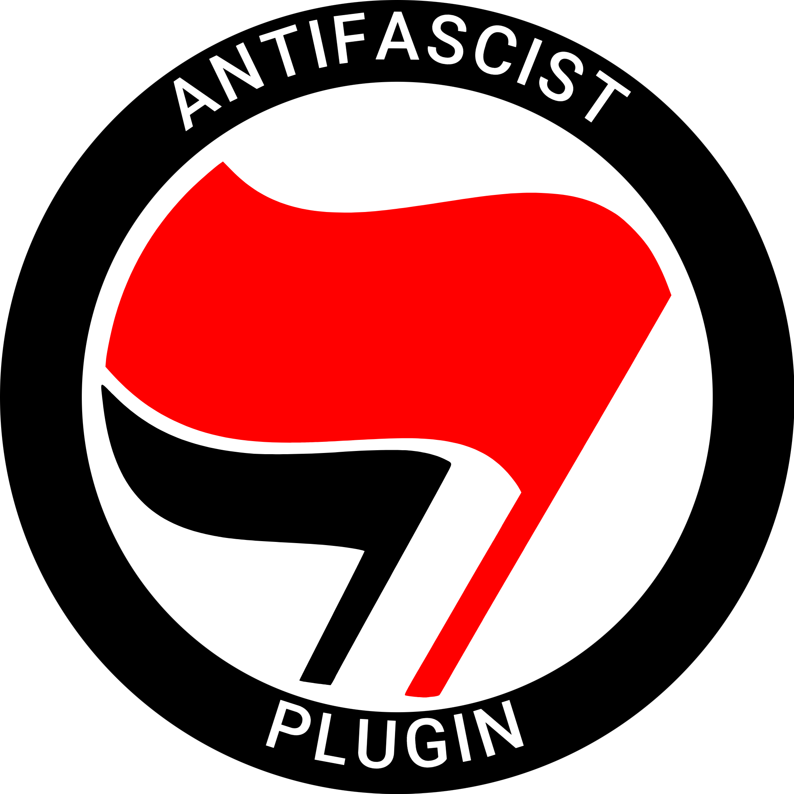

"I am an antifascist" is a sentence that should come easily to everyone, because there are topics on which you cannot remain neutral, and fascism is such a topic.

This plugin is an antifascist WordPress plugin that asks new users whether they are antifascist or fascist and thus holds up a mirror to all those who do not want to make up their mind between antifascism and fascism. Fascists are obviously not allowed to register.

